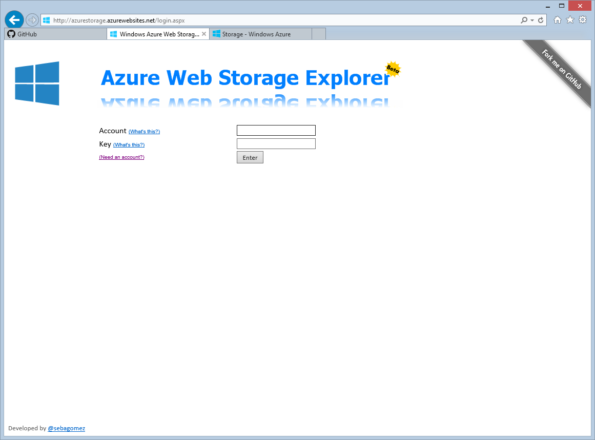
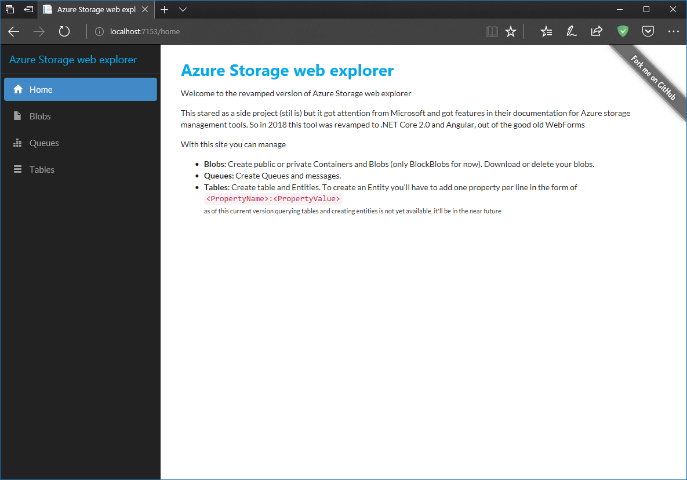

Try it live at https://azurestorage.azurewebsites.net

Or deploy it to your own Azure WebSite  
 <-- [coolest Azure feature](http://sgomez.blogspot.com.uy/2014/11/deploy-to-azure-button-wow.html) ever!

Azure Storage Explorer
======================
Azure Storage Web Explorer makes it easier for developers to browse and manage Blobs, Queues and Tables from Azure Storage. You'll no longer have to install a local client to do that. It was originally developed in C# with asp.net and WebForms 2.0, but now it has been migrated to .net Core 2.0 and Angular.

To login just enter your account name and key or SAS ([Shared Access Signature](https://docs.microsoft.com/en-us/azure/storage/storage-create-storage-account#manage-your-storage-account))

**Blobs**: Create public or private Containers and Blobs (only BlockBlobs for now). Download or delete your blobs.

**Queues**: Create Queues and messages.

**Tables**: Create table and Entities. To create an Entity you'll have to add one property per line in the form of `<PropertyName>:<PropertyValue>`

If you don't set PertitionKey or RowKey default values will be used ("1" for PartitionKey and a new Guid for RowKey).
For Example to create a new movie:
> PartitionKey:Action
RowKey:1
Title:Die Hard

To query the entities from a table use the following syntax: `<PropertyName> [operator] <ProepertyValue>`
Where the valid operators are:  *eq* (equals), *gt* (greater than), *ge* (greater or equal), *lt* (less than), *le* (less or equal) and *ne* (not equal).   
To query action movies use the following:
> PartitionKey eq 'Action'  

*Please note there's a <kbd>space</kbd> character before and after the **eq** operator.*

If you don't write a query the system will retrieve every Entity on the Table
