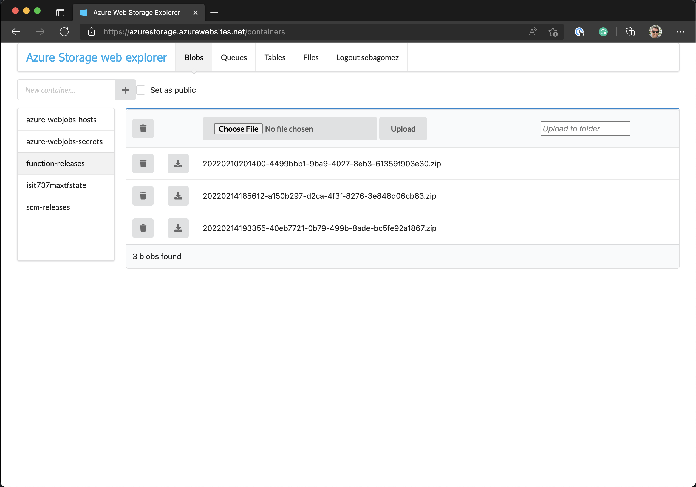

[](https://github.com/sebagomez/azurestorageexplorer/actions/workflows/dotnet-build.yml)
[](https://github.com/sebagomez/azurestorageexplorer/actions/workflows/docker-build.yml)
[](https://github.com/sebagomez/azurestorageexplorer/actions/workflows/helm-release.yml)

[](https://hub.docker.com/r/sebagomez/azurestorageexplorer)
 
Try it live at https://azurestorage.azurewebsites.net

Or deploy it wherever you want thanks to [docker images](https://hub.docker.com/r/sebagomez/azurestorageexplorer/) (created with GitHub Actions)

# Azure Storage Explorer

Azure Storage Web Explorer makes it easier for developers to browse and manage Blobs, Queues and Tables from Azure Storage. You'll no longer have to install a local client to do that. It was originally developed in C# with asp.net and WebForms 2.0, but now it has been migrated to .NET ~~Core 2.1, 2.2, 3.1, 5.0~~ 6.0 and Angular.

To login just enter your account name and key or SAS ([Shared Access Signature](https://docs.microsoft.com/en-us/azure/storage/storage-create-storage-account#manage-your-storage-account))




**Blobs**: Create public or private Containers and Blobs (only BlockBlobs for now). Download or delete your blobs.

**Queues**: Create Queues and messages.

**File Shares**: Navigate across File Shares and directories.

**Tables**: Create table and Entities. To create an Entity you'll have to add one property per line in the form of `<PropertyName>='<PropertyValue>'`

If you don't set PertitionKey or RowKey default values will be used ("1" for PartitionKey and a current timestamp for RowKey).  
For example to create a new movie:
> PartitionKey=Action  
RowKey=1  
Title=Die Hard  

To query the entities from a table use the following syntax: `<PropertyName> [operator] <ProepertyValue>`
Where the valid operators are:  *eq* (equals), *gt* (greater than), *ge* (greater or equal), *lt* (less than), *le* (less or equal) and *ne* (not equal).   
Take a look at the [supported comparaison operators](https://docs.microsoft.com/en-us/rest/api/storageservices/querying-tables-and-entities#supported-comparison-operators)  
To query action movies use the following:
> PartitionKey eq 'Action'  

*Please note there's a <kbd>space</kbd> character before and after the **eq** operator.*

If you don't write a query the system will retrieve every Entity on the Table

## Docker

This web app is not integrated with Azure Pipelines, and after the build process it'll create a Docker image (via multi-stage build) and publishes it to [hub.docker.com](https://hub.docker.com/r/sebagomez/azurestorageexplorer/).

```Dockerfile
FROM mcr.microsoft.com/dotnet/sdk:6.0-focal as builder

ENV SKIP_SASS_BINARY_DOWNLOAD_FOR_CI=true SKIP_NODE_SASS_TESTS=true

RUN curl -sL https://deb.nodesource.com/setup_14.x | bash - && \
    apt update && \
    apt-get install -y nodejs && \
    apt-get install -y build-essential && \
    apt-get install -y python2.7 && \
    npm config set python /usr/bin/python2.7 && \
    npm install -g @angular/cli 


WORKDIR /src
COPY ./ /src

RUN dotnet publish --configuration Release -o ./bin ./AzureWebStorageExplorer/AzureWebStorageExplorer.csproj

FROM mcr.microsoft.com/dotnet/aspnet:6.0

LABEL maintainer="seba gomez <@sebagomez>"

ARG BUILD
ENV APPVERSION=$BUILD

WORKDIR /app

COPY --from=builder /src/bin ./

ENTRYPOINT ["dotnet", "AzureWebStorageExplorer.dll"]
```

To fire a container with the latest version just run the following command

```sh
docker run --rm -it -p 5555:80 sebagomez/azurestorageexplorer
```

Then open your browser and navigate to http://localhost:5555, and voilá!

## Kubernetes

As of version 2.7.1 there's a new Helm chart with this project ready to be deployed in your favorite K8s cluster.  
If you want this app to run in your cluster, make sure you have [helm](https://helm.sh/docs/intro/install/) installed on your system.

Add the repo

```sh
helm repo add sebagomez https://sebagomez.github.io/azurestorageexplorer
```

Install the chart

```sh
helm install azurestorageexplorer sebagomez/azurestorageexplorer
```

The helm chart provides a deployment and a service, you can enable port-forwarding to that service with the following command: 
```sh
kubectl port-forward service/azurestorageexplorer 8080:80
```

or, you can follow helm instructions the get the application URL:

```sh
export POD_NAME=$(kubectl get pods --namespace default -l "app.kubernetes.io/name=azurestorageexplorer,app.kubernetes.io/instance=azurestorageexplorer" -o jsonpath="{.items[0].metadata.name}")
export CONTAINER_PORT=$(kubectl get pod --namespace default $POD_NAME -o jsonpath="{.spec.containers[0].ports[0].containerPort}")
echo "Visit http://127.0.0.1:8080 to use your application"
kubectl --namespace default port-forward $POD_NAME 8080:$CONTAINER_PORT
```

Thanks to [this repo](https://github.com/int128/helm-github-pages) for the info and detailed steps on how to create your own Helm repo with GitHub pages.

## Run locally

If you want to run this site on your own environment, don't want to clone it, and don't want to get into Docker (seriously, go learn some Docker), you can now do the following: 
* Go to the Release tab and select the newest (first one from the top)
* Download the zip file names in the form YYYYMMDD.X.
* Extract that zip in a folder in your local computer
* CMD into that folder and cd into the `root`  folder 
* Run `dotnet AzureWebStorageExplorer.dll`

Kestrell will kick in and you'll see in the terminal what port number was asigned, navigate to that port, in my case http://localhost:5000 and that's it!


## Build

To build this repo make sure you install .NET 6.0 sdk and Node.js v14.15.4. Take a look at [Node distributions](https://github.com/nodesource/distributions/blob/master/README.md) on how to install it.

Go to ClientApp and install the Angular CLI  
```sh
cd .\src\AzureWebStorageExplorer\ClientApp\
npm install -g @angular/cli
```

Update the packages  
```sh
npm update
```

Build the project
```sh
dotnet build .\src\AzureWebStorageExplorer\AzureWebStorageExplorer.csproj
```

### Docker 

There's a docker image at [sebagomez/buildazurestorage](https://hub.docker.com/r/sebagomez/buildazurestorage) that you can use to build the solution. Just run the `./build.sh` script and the output will be copied to the `./bin` folder.

Then just got to the folder and run `dotnet AzureWebStorageExplorer.dll`.
