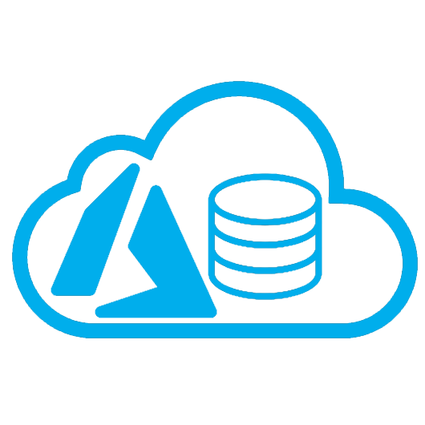
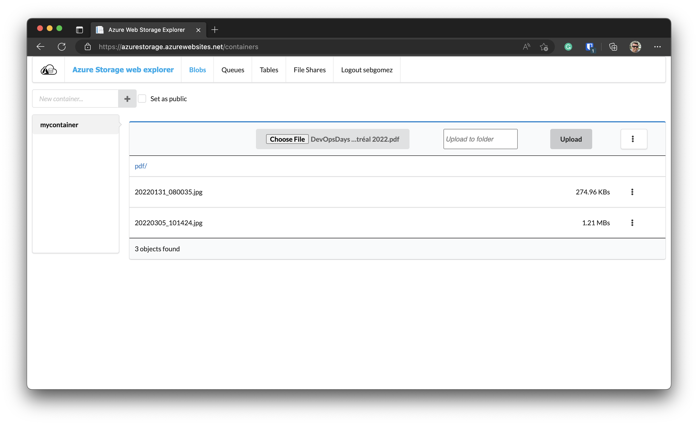

[](https://github.com/sebagomez/azurestorageexplorer/actions/workflows/dotnet-build.yml)
[](https://github.com/sebagomez/azurestorageexplorer/actions/workflows/docker-build.yml)
[](https://github.com/sebagomez/azurestorageexplorer/actions/workflows/helm-release.yml)

[](https://hub.docker.com/r/sebagomez/azurestorageexplorer)

[Just for fun](https://justforfunnoreally.dev/)

Try it live at https://azurestorage.azurewebsites.net

Or deploy it wherever you want thanks to [docker images](https://hub.docker.com/r/sebagomez/azurestorageexplorer/) (created with GitHub Actions)



# Azure Storage Explorer

Azure Storage Web Explorer makes it easier for developers to browse and manage Blobs, Queues and Tables from Azure Storage. You'll no longer have to install a local client to do that. It was originally developed in C# with asp.net and WebForms 2.0, but now it has been migrated to .NET ~~Core 2.1, 2.2, 3.1, 5.0~~ 6.0 and ~~Angular~~. *Edit:* Sick and tired of all del npm module and dependency hell I moved this project to a Blazor Server app.


To login just enter your account name and key or SAS ([Shared Access Signature](https://docs.microsoft.com/en-us/azure/storage/storage-create-storage-account#manage-your-storage-account))




**Blobs**: Create public or private Containers and Blobs (only BlockBlobs for now). Download or delete your blobs.

**Queues**: Create Queues and messages.

**File Shares**: Navigate across File Shares and directories.

**Tables**: Create table and Entities. To create an Entity you'll have to add one property per line in the form of `<PropertyName>='<PropertyValue>'`

If you don't set PertitionKey or RowKey default values will be used ("1" for PartitionKey and a current timestamp for RowKey).  
For example to create a new movie:
> PartitionKey=Action  
RowKey=1  
Title=Die Hard  

You can also set the desired data type for a specific property setting the desired EEdm datatype as follows:
> Year=1978   
Year@odata.type=Edm.Int32

This will create the `Year` as a 32 bit integer in the table.

Allowed datatypes are the following:
```
Edm.Int64
Edm.Int32
Edm.Boolean
Edm.DateTime
Edm.Double
Edm.Guid
```
Anything else would be treated as a string.

To query the entities from a table use the following syntax: `<PropertyName> [operator] <ProepertyValue>`
Where the valid operators are:  *eq* (equals), *gt* (greater than), *ge* (greater or equal), *lt* (less than), *le* (less or equal) and *ne* (not equal).   
Take a look at the [supported comparaison operators](https://docs.microsoft.com/en-us/rest/api/storageservices/querying-tables-and-entities#supported-comparison-operators)  
To query action movies use the following:
> PartitionKey eq 'Action'  

*Please note there's a <kbd>space</kbd> character before and after the **eq** operator.*

If you don't write a query the system will retrieve every Entity on the Table

## Build

To build this repo make sure you install .NET 6.0 sdk.

At the root of the project just execute the ./build.sh script
```sh
./build.sh
```

## Run locally

Just execute the [./publish.sh](./publish.sh) script on the root folder on the repo. Kestrell will kick in and you'll see in the terminal what port number was asigned, navigate to that port, in my case http://localhost:5000 and that's it!


### Docker 

## Docker

There's a docker image at [hub.docker.com](https://hub.docker.com/r/sebagomez/azurestorageexplorer/) that you can use to run this app on the environment of your choice. Keep reading for Kubernetes.

To spin up a container with the latest version just run the following command

```sh
docker run --rm -it -p 5555:80 sebagomez/azurestorageexplorer
```

Then open your browser and navigate to http://localhost:5555, and voilá!

## Kubernetes

As of version 2.7.1 there's a new Helm chart with this project ready to be deployed in your favorite K8s cluster.  
If you want this app to run in your cluster, make sure you have [helm](https://helm.sh/docs/intro/install/) installed on your system.

Add the repo

```sh
helm repo add sebagomez https://sebagomez.github.io/azurestorageexplorer
```

Install the chart

```sh
helm install azurestorageexplorer sebagomez/azurestorageexplorer
```

The helm chart provides a deployment and a service, you can enable port-forwarding to that service with the following command: 
```sh
kubectl port-forward service/azurestorageexplorer 8080:80
```

or, you can follow helm instructions the get the application URL:

```sh
export POD_NAME=$(kubectl get pods --namespace default -l "app.kubernetes.io/name=azurestorageexplorer,app.kubernetes.io/instance=azurestorageexplorer" -o jsonpath="{.items[0].metadata.name}")
export CONTAINER_PORT=$(kubectl get pod --namespace default $POD_NAME -o jsonpath="{.spec.containers[0].ports[0].containerPort}")
echo "Visit http://127.0.0.1:8080 to use your application"
kubectl --namespace default port-forward $POD_NAME 8080:$CONTAINER_PORT
```

Thanks to [this repo](https://github.com/int128/helm-github-pages) for the info and detailed steps on how to create your own Helm repo with GitHub pages.
